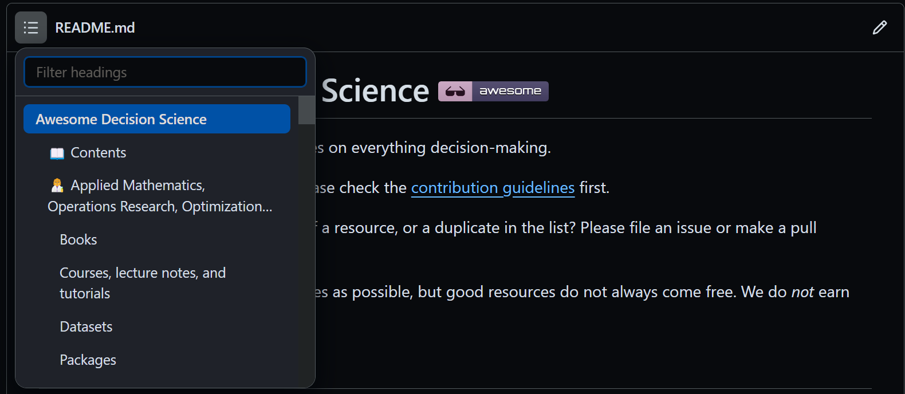

# Awesome Decision Science 
A professionally curated list of resources on everything decision-making.

👍Do you like the project and want to help spread the word?👍

Here's what you can do:
- give it a star⭐
- add it to your watchlist👁️
- contribute. Please check the [contribution guidelines](https://github.com/mpalenciaolivar/Awesome-Decision-Science/blob/main/CONTRIBUTING.md) first.

❗Found a broken link, a newer version of a resource, or a duplicate in the list? Please file an issue or make a pull request!❗

⚠️ We try to add as many free resources as possible, but good resources do not always come free. We do *not* earn any money from sales. ⚠️

🍔Click on the hamburger next to the file name for a better browsing experience:

## 🤖 Artificial Intelligence and Computational Intelligence
### Books
#### Computational Intelligence
- Engelbrecht, Andries P. Computational intelligence: an introduction. John Wiley & Sons, 2007. [[Link]](https://onlinelibrary.wiley.com/doi/book/10.1002/9780470512517)
#### Deep Learning
- Deisenroth, Marc Peter, A. Aldo Faisal, and Cheng Soon Ong. Mathematics for machine learning. Cambridge University Press, 2020. [[Link]](https://mml-book.github.io/)
- Goodfellow, Ian, Yoshua Bengio, and Aaron Courville. Deep learning. MIT Press, 2016. [[Link]](https://www.deeplearningbook.org/)
- Simon Prince. Understanding Deep Learning. MIT Press, to appear. [[Link]](https://udlbook.github.io/udlbook/)
- Aston Zhang, Zack Lipton, Mu Li, Alex Smola. Dive into Deep Learning. [[Link]](https://d2l.ai/)
- Philipp Grohs, Gitta Kutyniok. Mathematical Aspects of Deep Learning. [[Link]](https://www.cambridge.org/core/books/mathematical-aspects-of-deep-learning/8D9B41D1E9BB8CA515E93412EECC2A7E)
#### Machine Learning
- Bishop, Christopher M., and Nasser M. Nasrabadi. Pattern recognition and machine learning. Vol. 4. No. 4. New York: Springer, 2006. [[Link]](https://www.microsoft.com/en-us/research/publication/pattern-recognition-machine-learning/)
- James, G., Witten, D., Hastie, T., Tibshirani, R., Taylor, J. An Introduction to Statistical Learning: With Applications in Python; Springer: Berlin/Heidelberg, Germany, 2023. [[Link]](https://www.statlearning.com/)
- Katsov, Ilya. Introduction to algorithmic marketing: Artificial intelligence for marketing operations. Grid Dynamics, 2017. [[Link]](https://www.algorithmicmarketingbook.com/)
- Murphy, Kevin P. Probabilistic machine learning: Advanced topics. MIT Press, 2023. [[Link]](https://probml.github.io/pml-book/book2.html)
- Murphy, Kevin P. Probabilistic machine learning: an introduction. MIT Press, 2022. [[Link]](https://probml.github.io/pml-book/book1.html)
- Siddiqi, Naeem. Intelligent credit scoring: Building and implementing better credit risk scorecards. John Wiley & Sons, 2017. [[Link]](https://www.wiley.com/en-fr/Intelligent+Credit+Scoring%3A+Building+and+Implementing+Better+Credit+Risk+Scorecards%2C+2nd+Edition-p-9781119279150)
### Courses, lecture notes, and tutorials
#### Deep Learning
- Lippe, Phillip. UvA Deep Learning Tutorials. 2022. [[Link]](https://uvadlc-notebooks.readthedocs.io/en/latest/)
- Ollion, Charles, and Olivier Grisel. Deep Learning course: lecture slides and lab notebooks. Institut Polytechnique de Paris, 2017. [[Link]](https://m2dsupsdlclass.github.io/lectures-labs/)
##### Bayesian approaches
- Arbel, Julyan, et al. A Primer on Bayesian Neural Networks: Review and Debates. arXiv preprint arXiv:2309.16314 (2023). [[Link]](https://arxiv.org/abs/2309.16314)
- Hellström, Fredrik, et al. Generalization bounds: perspectives from information theory and PAC-Bayes. arXiv preprint arXiv:2309.04381 (2023). [[Link]](https://arxiv.org/abs/2309.04381)
##### Generative aspects
- Coste, Simon. Diffusion. University of Paris, 2023. [[Link]](https://scoste.fr/posts/diffusion/)
- Galerne, Bruno, and Valentin De Bortoli. Generative Modelling. ENS Paris-Saclay, 2023. [[Link]](https://vdeborto.github.io/project/generative_modeling/)
##### Mathematical aspects: approximation and generalization
- Bartlett, Peter L., Andrea Montanari, and Alexander Rakhlin. Deep learning: a statistical viewpoint. Acta numerica 30 (2021): 87-201. [[Link]](https://arxiv.org/abs/2103.09177)
- Berner, Julius, et al. The modern mathematics of deep learning. arXiv preprint arXiv:2105.04026 (2021): 86-114. [[Link]](https://arxiv.org/abs/2105.04026)
- DeVore, Ronald, Boris Hanin, and Guergana Petrova. Neural network approximation. Acta Numerica 30 (2021): 327-444. [[Link]](https://arxiv.org/abs/2012.14501)
- Petersen, Philipp Christian. Neural network theory. University of Vienna 535 (2020). [[Link]](http://pc-petersen.eu/Neural_Network_Theory.pdf)
##### Mathematical aspects: optimization
- Khaled, Ahmed, and Peter Richtárik. "Better theory for SGD in the nonconvex world." arXiv preprint arXiv:2002.03329 (2020). [[Link]](https://arxiv.org/abs/2002.03329)
- Sun, Ruoyu. Optimization for deep learning: theory and algorithms. arXiv preprint arXiv:1912.08957 (2019). [[Link]](https://arxiv.org/abs/1912.08957)
#### Machine Learning
- MLU-Explain Team. MLU-Explain. Amazon (2021). [[Link]](https://mlu-explain.github.io/)
#### Reinforcement Learning and Control Theory 
- Dimitry Bertsekas. Reinforcement Learning and Optimal Control. [[Link]](http://www.mit.edu/~dimitrib/RLbook.html)
- Elad Hazan, Karan Singh. Introduction to Online Nonstochastic Control. [[Link]](https://arxiv.org/abs/2211.09619)
### Datasets
- Andreas Luttens, et al. Large-scale Docking Datasets for Machine Learning. 2, Zenodo, 8 May 2023. [[Link]](https://zenodo.org/records/7953917)

### Packages
#### Machine Learning
- Catboost. A fast, scalable, high-performance Gradient Boosting on Decision Trees library used for ranking, classification, regression, and other machine learning tasks for Python, R, Java, and C++. Supports computation on CPU and GPU. [[Link]](https://catboost.ai/)

### Papers
#### Deep Learning
#### Machine Learning
- Angelopoulos, Anastasios N., and Stephen Bates. "A gentle introduction to conformal prediction and distribution-free uncertainty quantification." arXiv preprint arXiv:2107.07511 (2021).
- Breiman, Leo. "Statistical modeling: The two cultures (with comments and a rejoinder by the author)." Statistical science 16.3 (2001): 199-231. [[Link]](https://projecteuclid.org/journals/statistical-science/volume-16/issue-3/Statistical-Modeling--The-Two-Cultures-with-comments-and-a/10.1214/ss/1009213726.pdf)
- Fontana, Matteo, Gianluca Zeni, and Simone Vantini. "Conformal prediction: a unified review of theory and new challenges." arXiv preprint arXiv:2005.07972 (2020).
### Talks, conferences, and videos
- Dieng, Adji B. Learning From Data: The Two Cultures. Association for Computing Machinery, 2021. [[Link]](https://youtu.be/JJnTLNoNTME?si=uiuHKCcPFhF7sz6h)
- Rich, DJ. Mutual Information. True Theta LLC, 2020. [[Link]](https://www.youtube.com/@Mutual_Information)

## 📊 Business Intelligence, Data Visualization, Communicating and Reporting
### Books
- Duarte, Nancy. Resonate: Present visual stories that transform audiences. John Wiley & Sons, 2013. [[Link]](https://www.duarte.com/resources/books/resonate/)
- Duarte, Nancy. Slide: ology: The art and science of creating great presentations. Vol. 1. Sebastapol: O'Reilly Media, 2008. [[Link]](https://www.duarte.com/resources/books/slideology/)
- Knaflic, Cole Nussbaumer. Storytelling with data: A data visualization guide for business professionals. John Wiley & Sons, 2015. [[Link]](https://www.storytellingwithdata.com/books)
- Knaflic, Cole Nussbaumer. Storytelling with data: let's practice!. John Wiley & Sons, 2019. [[Link]](https://www.storytellingwithdata.com/books)
- Wexler, Steve, Jeffrey Shaffer, and Andy Cotgreave. The big book of dashboards: visualizing your data using real-world business scenarios. John Wiley & Sons, 2017. [[Link]](https://www.bigbookofdashboards.com/)
- Wilke, Claus O. Fundamentals of data visualization: a primer on making informative and compelling figures. O'Reilly Media, 2019. [[Link]](https://clauswilke.com/dataviz/)

### Courses, lecture notes, and tutorials
### Datasets
### Packages
#### Data structures
##### Python
- Polars. Dataframes powered by a multithreaded, vectorized query engine, written in Rust. [[Link]](https://www.pola.rs/)

#### Data Visualization and Reporting
##### Python
- PyGWalker. Turn your pandas dataframe into an interactive UI for visual analysis. [[Link]](https://docs.kanaries.net/pygwalker)
- Streamlit. A faster way to build and share data apps. [[Link]](https://streamlit.io/)
- Vizro. Vizro is a toolkit for creating modular data visualization applications. [[Link]](https://github.com/mckinsey/vizro)

##### Julia
- Genie. 🧞The highly productive Julia web framework. [[Link]](https://genieframework.com/)

### Papers
### Talks, conferences, and videos

## 💻 Computer Science and Software Engineering
### Books
#### Algorithmics, data structures, and programming languages
- Downey, Allen. Think complexity: complexity science and computational modeling. " O'Reilly Media, Inc.", 2018. [[Link]](https://www.greenteapress.com/complexity/)
- Downey, Allen. Think data structures: algorithms and information retrieval in Java. " O'Reilly Media, Inc.", 2017. [[Link]](https://greenteapress.com/wp/think-data-structures/)
- Downey, Allen. Think Python. " O'Reilly Media, Inc.", 2012. [[Link]](https://greenteapress.com/wp/think-python-2e/)
- Johnston, Nathaniel, and Dave Greene. Conway's Game of Life: Mathematics and Construction. Self-published, 2022. [[Link]](https://conwaylife.com/book/)
- Miller, Brad, and David Ranum. Problem-solving with algorithms and data structures. University of Auckland, 2013. [[Link]](https://dlib.hust.edu.vn/bitstream/HUST/17856/1/OER000000244.pdf) [[Website]](https://www.openbookproject.net/books/pythonds/index.html)

### Courses, lecture notes, and tutorials
- Shvets, Alexander. Refactoring Guru. 2014. [[Link]](https://refactoring.guru/)

### Packages
### Papers
### Talks, conferences, and videos

## 🗺️ Geospatial Analysis
### Books
- Lovelace, Robin, Jakub Nowosad, and Jannes Muenchow. Geocomputation with R. CRC Press, 2019. [[Link]](https://r.geocompx.org/)
- Moraga, Paula. Geospatial health data: Modeling and visualization with R-INLA and shiny. CRC Press, 2019. [[Link]](https://www.paulamoraga.com/book-geospatial/)
- Moraga, Paula. Spatial Statistics for Data Science: Theory and Practice with R. CRC Press, 2023. [[Link]](https://www.paulamoraga.com/book-spatial/)
### Courses, lecture notes, and tutorials
### Datasets
### Packages
### Papers
### Talks, conferences, and videos

## 👩‍🔬 Mathematics, Operations Research, Game Theory, and Simulations
### Books
#### Applied Mathematics
- Isoz, Vincent. Opera Magistris (Elements of Applied Mathematics). Sciences.ch, 2016. [[Link]](https://archive.org/details/OperaMagistris)
#### Game Theory and Simulations
- Downey, Allen B. Modeling and Simulation in Python: An Introduction for Scientists and Engineers. No Starch Press, 2023. [[Link]](https://greenteapress.com/wp/modsimpy/)
#### Graph Theory
- McNulty, Keith. Handbook of graphs and networks in people analytics: with examples in R and Python. CRC Press, 2022. [[Link]](https://ona-book.org/index.html)
- Sargent, Thomas J., and John Stachurski. Economic Networks: Theory and Computation. QuantEcon, 2022. [[Link]](https://networks.quantecon.org/)
#### Optimization
- Boumal, Nicolas. An Introduction to Optimization on Smooth Manifolds. Cambridge University Press, 2023. [[Link]](https://www.nicolasboumal.net/book/)
- Boyd, Stephen P., and Lieven Vandenberghe. Convex optimization. Cambridge University Press, 2004. [[Link]](https://web.stanford.edu/~boyd/cvxbook/)
- Kwon, Changhyun. Julia Programming for Operations Research. Changhyun Kwon, 2019. [[Link]](https://juliabook.chkwon.net/book/frontmatter)
- Martins, J. R. R. A. and Ning, A., Engineering Design Optimization, Cambridge University Press, 2022. [[Link]](https://mdobook.github.io/)
- Sargent, Thomas J., and John Stachurski. Dynamic Programming Volume 1. QuantEcon, 2023. [[Link]](https://dp.quantecon.org/)
#### Sequential Problems
- Powell, Warren B. Sequential decision analytics and modeling: modeling with Python. Now, 2022. [[Link]](https://castle.princeton.edu/sdamodeling/)

### Courses, lecture notes, and tutorials
- Arya, Nisha. Learn Probability in Computer Science with Stanford University for FREE. KDNuggets, 2023. [[Link]](https://www.kdnuggets.com/learn-probability-in-computer-science-with-stanford-university-for-free)
### Datasets
### Packages
### Papers

### Talks, conferences, and videos
- MATLAB. Why Padé Approximations Are Great! | Control Systems in Practice. YouTube, 2022. [[Link]](https://www.youtube.com/watch?v=3TK8Fi_I0h0)

## 📈 Statistics, Econometrics, Causality, and Data Mining
### Books
#### Data Mining
- Govaert, Gérard, and Mohamed Nadif. Co-clustering: models, algorithms and applications. John Wiley & Sons, 2013. [[Link]](https://www.amazon.fr/Co-Clustering-G%C3%A9rard-Govaert/dp/1848214731/ref=tmm_hrd_swatch_0?_encoding=UTF8&qid=1697294646&sr=8-1)

#### Econometrics
- Wooldridge, Jeffrey M.. Introductory Econometrics: A Modern Approach. Brésil, Cengage Learning, 2020. [[Link]](https://www.amazon.fr/Introductory-Econometrics-Approach-Jeffrey-Wooldridge/dp/1337558869/ref=sr_1_1?crid=1B5NKJCMW9EM0&keywords=econometrics+a+modern+approach&psr=PDAY&qid=1696924730&s=pbdd&sprefix=econmetrics+a+modern+approach%2Cpbdd%2C94&sr=1-1)

#### Statistics
- Agresti, Alan. Categorical data analysis. Vol. 792. John Wiley & Sons, 2012. [[Link]](https://www.wiley.com/en-us/Categorical+Data+Analysis%2C+3rd+Edition-p-9781118710944)
- Kuhn, Max, and Julia Silge. Tidy modeling with R. " O'Reilly Media, Inc.", 2022. [[Link]](https://www.tmwr.org/index.html)
- McElreath, Richard. Statistical rethinking: A Bayesian course with examples in R and Stan. Chapman and Hall/CRC, 2020. [[Link]](https://xcelab.net/rm/statistical-rethinking/)
- McNulty, Keith. Handbook of regression modeling in people analytics: with examples in R and Python. CRC Press, 2021. [[Link]](https://peopleanalytics-regression-book.org/index.html)
- Soch, Joram, et al. StatProofBook/StatProofBook.Github.Io: StatProofBook 2021. 2021, Zenodo, 2022. [[Link]](https://statproofbook.github.io/)
- Van Buuren, Stef. Flexible imputation of missing data. CRC Press, 2018. [[Link]](https://stefvanbuuren.name/fimd/)
- Wasserman, Larry. All of statistics: a concise course in statistical inference. Vol. 26. New York: Springer, 2004. [[Link]](https://www.stat.cmu.edu/~larry/all-of-statistics/)
- Wickham, H., Çetinkaya-Rundel, M., & Grolemund, G. (2023). R for data science. " O'Reilly Media, Inc.". [[Link]](https://r4ds.hadley.nz/)

### Courses, lecture notes, and tutorials
- Canay, Ivan. Econ 480-3 - Introduction to Econometrics. Northwestern University, 2021. [[Link]](https://sites.northwestern.edu/iac879/teaching/e-lectures-econ480/)
- De Haan, Monique. ECON4150 - Introductory Econometrics. University of Oslo, 2018. [[Link]](https://www.uio.no/studier/emner/sv/oekonomi/ECON4150/v18/)
- Kunin, Daniel, et al. Seeing Theory. Brown University, 2016. [[Link]](https://seeing-theory.brown.edu/)

### Datasets
- "6 Free, High-Quality, Marketing Mix Modeling Datasets | Forecastegy." Web. 10/14/2023 [[Link]](https://forecastegy.com/posts/free-high-quality-marketing-mix-modeling-datasets)
- Gaël Bernard and Periklis Andritsos. Datasets Simulating Customer Journeys. [[Link]](https://customer-journey.me/datasets/)

### Packages
### Papers
#### Probabilistic Graphical Models
- Blei, David M. Build, compute, critique, repeat: Data analysis with latent variable models. Annual Review of Statistics and Its Application 1 (2014): 203-232. [[Link]](https://www.annualreviews.org/doi/abs/10.1146/annurev-statistics-022513-115657)
- Blei, David M., Alp Kucukelbir, and Jon D. McAuliffe. "Variational inference: A review for statisticians." Journal of the American Statistical Association 112.518 (2017): 859-877. [[Link]](https://arxiv.org/pdf/1601.00670)
- Dieng, Adji Bousso. Deep Probabilistic Graphical Modeling. Columbia University, 2020. [[Link]](https://arxiv.org/abs/2104.12053)
- Figurnov, Mikhail, Shakir Mohamed, and Andriy Mnih. "Implicit reparameterization gradients." Advances in neural information processing systems 31 (2018). [[Link]](https://proceedings.neurips.cc/paper_files/paper/2018/file/92c8c96e4c37100777c7190b76d28233-Paper.pdf)
- Gelman, Andrew, Xiao-Li Meng, and Hal Stern. "Posterior predictive assessment of model fitness via realized discrepancies." Statistica sinica (1996): 733-760. [[Link]](https://www.jstor.org/stable/24306036)

#### Statistics
##### Distributions
- Leemis, Lawrence M., and Jacquelyn T. McQueston. "Univariate distribution relationships." The American Statistician 62.1 (2008): 45-53. [[Paper]](https://www.math.wm.edu/~leemis/2008amstat.pdf) [[Website]](https://www.math.wm.edu/~leemis/chart/UDR/UDR.html).

##### Statistical hypothesis testing (NHST)
- Gelman, Andrew. “Commentary: P Values and Statistical Practice.” Epidemiology, vol. 24, no. 1, 2013, pp. 69–72. JSTOR. Accessed 10 Dec. 2023. [[Link]](https://stat.columbia.edu/~gelman/research/published/asa_pvalues.pdf)
- Greenland, Sander et al. “Statistical tests, P values, confidence intervals, and power: a guide to misinterpretations.” European journal of epidemiology vol. 31,4 (2016): 337-50. doi:10.1007/s10654-016-0149-3 [[Link]](https://www.ncbi.nlm.nih.gov/pmc/articles/PMC4877414/)
- Lakens, Daniël. “Equivalence Tests: A Practical Primer for t Tests, Correlations, and Meta-Analyses.” Social psychological and personality science vol. 8,4 (2017): 355-362. doi:10.1177/1948550617697177 [[Link]](https://www.ncbi.nlm.nih.gov/pmc/articles/PMC5502906/)
- Lin, Mingfeng, et al. “Research Commentary: Too Big to Fail: Large Samples and the p-Value Problem.” Information Systems Research, vol. 24, no. 4, 2013, pp. 906–17. JSTOR. Accessed 10 Dec. 2023. [[Link]](http://www.stat.ntu.edu.tw/download/%E6%95%99%E5%AD%B8%E6%96%87%E4%BB%B6/bigdata/Research%20Commentary%20-%20Too%20Big%20to%20Fail%20Large%20Samples%20and%20the%20p-Value%20Problem.pdf)
- Lumley, Thomas et al. “The importance of the normality assumption in large public health data sets.” Annual review of public health vol. 23 (2002): 151-69. doi:10.1146/annurev.publhealth.23.100901.140546 [[Link]](https://pubmed.ncbi.nlm.nih.gov/11910059/)
- Mohd Razali, Nornadiah, and Bee Yap. ‘Power Comparisons of Shapiro-Wilk, Kolmogorov-Smirnov, Lilliefors and Anderson-Darling Tests’. J. Stat. Model. Analytics, vol. 2, 01 2011. [[Link]](https://www.researchgate.net/publication/267205556_Power_Comparisons_of_Shapiro-Wilk_Kolmogorov-Smirnov_Lilliefors_and_Anderson-Darling_Tests)
- Pernet, Cyril. “Null hypothesis significance testing: a short tutorial.” F1000Research vol. 4 621. 25 Aug. 2015, doi:10.12688/f1000research.6963.3 [[Link]](https://www.ncbi.nlm.nih.gov/pmc/articles/PMC5635437/)
- Serdar, Ceyhan Ceran et al. “Sample size, power and effect size revisited: simplified and practical approaches in pre-clinical, clinical and laboratory studies.” Biochemia medica vol. 31,1 (2021): 010502. doi:10.11613/BM.2021.010502 [[Link]](https://www.ncbi.nlm.nih.gov/pmc/articles/PMC7745163/)
- Verhagen, Arianne P., et al. ‘Is the p Value Really so Significant?*’. Australian Journal of Physiotherapy, vol. 50, no. 4, 2004, pp. 261–262. [[Link]](https://www.sciencedirect.com/science/article/pii/S0004951414601227)

### Talks, conferences, and videos
- Chopin, Nicolas, et al. "Bayesian Causal Inference for Real World Interactive Systems." Proceedings of the 27th ACM SIGKDD Conference on Knowledge Discovery & Data Mining. 2021.[[Link]](https://bcirwis2021.github.io/schedule.html)
- Maxim Kochurov. State of Bayes Lecture Series. PyMC Labs, 2023. [[Link]](https://www.youtube.com/watch?v=X4y2UfU-2cs&list=PL1iMFW7frOOsh5KOcfvKWM12bjh8zs9BQ)

## 📄 Text Mining and Natural Language Processing
### Books
- Silge, Julia, and David Robinson. Text mining with R: A tidy approach. " O'Reilly Media, Inc.", 2017. [[Link]](https://www.tidytextmining.com/)
### Courses, lecture notes, and tutorials
### Datasets
- Horwood, Ghraham V. Humanitarian Assistance and Disaster Relief (HA/DR) Articles and Lexicon. V1, Harvard Dataverse, 2017, doi:10.7910/DVN/TGOPRU. [[Link]](https://dataverse.harvard.edu/dataset.xhtml?persistentId=doi:10.7910/DVN/TGOPRU)
### Packages
### Papers
### Talks, conferences, and videos

## 💹 Time Series and Stochastic Processes
### Books
- Cochrane, John H. "Time series for macroeconomics and finance." (1997). [[Link]](https://static1.squarespace.com/static/5e6033a4ea02d801f37e15bb/t/5eea91f725f16202da96235d/1592431098027/time_series_book.pdf)
- Hyndman, R.J., & Athanasopoulos, G. (2021) Forecasting: principles and practice, 3rd edition, OTexts: Melbourne, Australia. [[Link]](https://otexts.com/fpp3/)
- Neusser, Klaus. Time series econometrics. Springer publication, 2016. [[Link]](https://www.amazon.fr/Time-Econometrics-Klaus-Neusser-ebook/dp/B01H30JHNA/ref=sr_1_1?crid=1QZFENEHXT9DG&keywords=Neusser%2C+Klaus.+Time+series+econometrics&qid=1696924805&sprefix=neusser%2C+klaus.+time+series+econometrics%2Caps%2C92&sr=8-1)

### Courses, lecture notes, and tutorials
### Datasets
- Godahewa, Rakshitha, et al. "Monash time series forecasting archive." arXiv preprint arXiv:2105.06643 (2021). [[Link]](https://arxiv.org/abs/2105.06643)
### Packages
#### Python
- Functime. Time-series machine learning at scale. Built on Polars for embarrassingly parallel feature engineering and forecasts. [[Link]](https://github.com/neocortexdb/functime)
- HierarchicalForecast. Probabilistic Hierarchical forecasting 👑 with statistical and econometric methods. [[Link]](https://nixtla.github.io/hierarchicalforecast/)
- mlforecast. Scalable machine 🤖 learning for time series forecasting. [[Link]](https://nixtla.github.io/mlforecast/)
- NeuralForecast. Scalable and user-friendly neural 🧠 forecasting algorithms. [[Link]](https://nixtla.github.io/neuralforecast/)
- StatsForecast. Lightning ⚡️ fast forecasting with statistical and econometric models. [[Link]](https://nixtla.github.io/statsforecast/)

### Papers
### Talks, conferences, and videos
- Hakenes, Hendrik. Ito's Lemma -- Some intuitive explanations on the solution of stochastic differential equations. University of Bonn, 2021. [[Link]](https://youtu.be/_4zyAFpJ_Z4?si=hd4aVpI3ClKavcyu)
